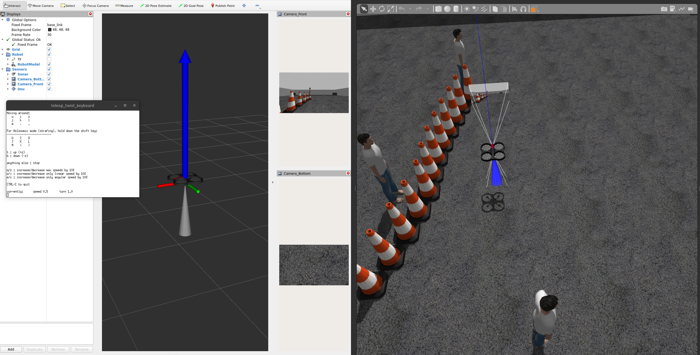

# sjtu_drone

sjtu_drone is a quadrotor simulation program forked from [tum_simulator](http://wiki.ros.org/tum_simulator), developed using ROS + Gazebo.

The acronym 'sjtu' stands for Shanghai Jiao Tong University. This package has been used in the past for testing algorithms for the [UAV contest at SJTU](http://mediasoc.sjtu.edu.cn/wordpress)

# Requirements

This package is tested with ROS 2 Humble version (Ubuntu 22.04) and Gazebo 11.

# Downloading and building

```
cd ~/git && git clone git@github.com:NovoG93/sjtu-drone.git 
cd ~/ros2_ws/src && ln -s ~/git/sjtu_drone
cd .. && rosdep install -r -y --from-paths src --ignore-src --rosdistro $ROS_DISTRO && colcon build --packages-select-regex sjtu*
```

## Drone Topics

### Sensors
The folowing sensors are currently implemented:
- ~/front_camera/image_raw [__sensor_msgs/msg/Image__]
- ~/bottom/image_raw [__sensor_msgs/msg/Image__]
- ~/sonar [__sensor_msgs/msg/Range__]
- ~/imu [__sensor_msgs/msg/Imu__]


### Control 
The following control topics are currently subscribed to:
- ~/cmd_vel [__geometry_msgs/msg/Twist__]: Steers the drone
- ~/land [__std_msgs/msg/Empty__]: Lands the drone
- ~/takeoff [__std_msgs/msg/Empty__]: Starts the drone
- ~/posctrl [__std_msgs/msg/Bool__]: 
- ~/dronevel_mode [__std_msgs/msg/Bool__]: Change the drone steering method
- ~/reset [__std_msgs/msg/Empty__]: Resets the drone

### Ground Truth
The following ground truth topics are currently published:
- ~/gt_acc [__geometry_msgs/msg/Twist__]: ground truth acceleration
- ~/gt_pose [__geometry_msgs/msg/Pose__]: ground truth pose
- ~/gt_vel [__geometry_msgs/msg/Twist__]: ground truth velocity


# Run

1. Start gazebo, spawn drone, open teleop in xterm window, and open rviz:   
`ros2 launch  sjtu_drone_bringup sjtu_drone_bringup.launch.py`
2. Takeoff drone:   
`ros2 topic pub /drone/takeoff std_msgs/msg/Empty {} --once`
3. Move drone: (use teleop window)
4. Land drone:
`ros2 topic pub /drone/land std_msgs/msg/Empty {} --once`

You should see the following:



For more see the following image:


